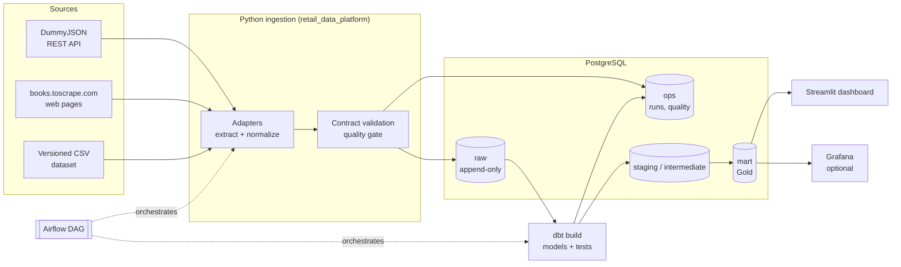
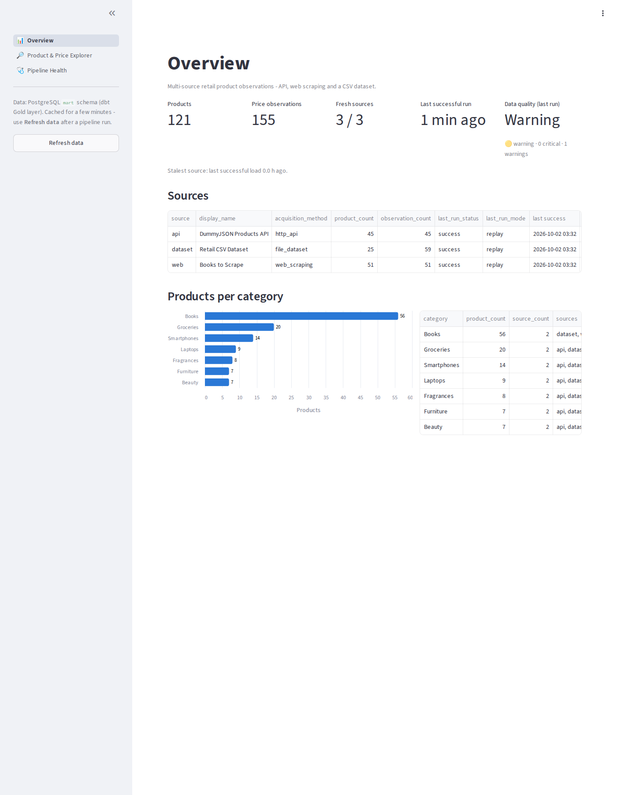
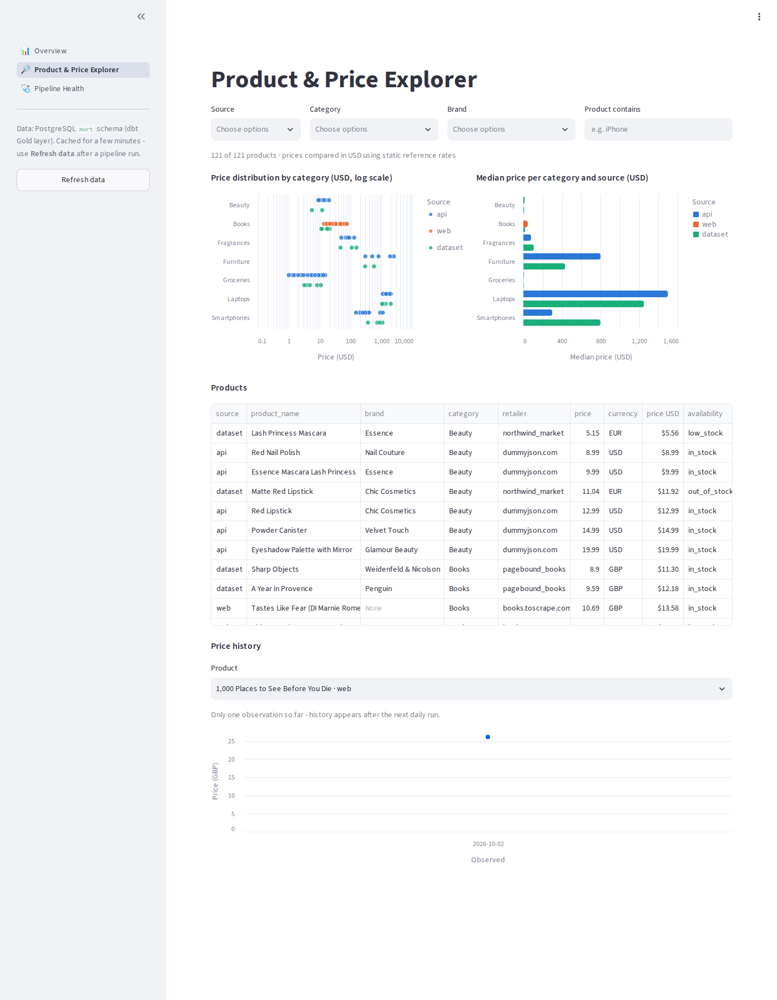
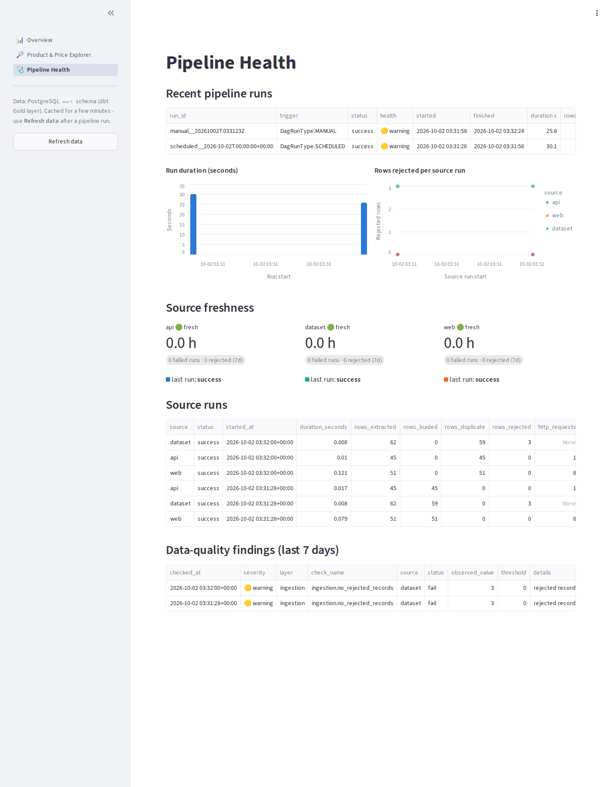
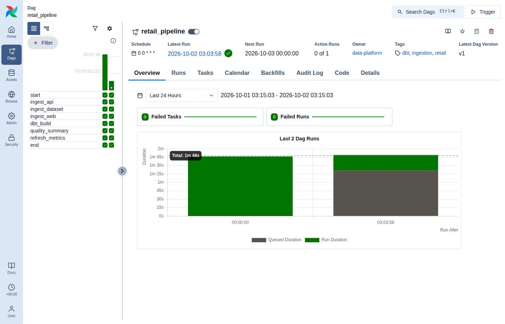

# Retail Data Platform

A small, production-minded data platform that collects retail product observations from three
different kinds of source, lands them in PostgreSQL, models them with dbt, enforces data quality
at several layers, orchestrates everything with Apache Airflow and serves the results through a
Streamlit dashboard. It deploys to a single cloud VM with Docker Compose behind Caddy (HTTPS);
Terraform for Azure is included.

It is a portfolio project sized for a small workload. The point is the engineering: contracts,
idempotency, testability, observability and operability. Scale is not the point. Read
[What would change at scale](#what-would-change-at-scale) before comparing it with a
big-data stack.



| Dashboard: overview | Price explorer | Pipeline health | Airflow DAG |
|---|---|---|---|
|  |  |  |  |

<sub>Screenshots from a local run in replay mode.</sub>

## What it demonstrates

| Area | Implementation |
|---|---|
| Multi-source ingestion | Paginated REST API, polite HTML scraper, file dataset; one `SourceAdapter` protocol |
| Resilient HTTP | Connect/read timeouts, exponential backoff + jitter, `Retry-After`, fail-fast on 4xx |
| Data contract | Pydantic `ProductObservation`; invalid records go to `raw.rejected_records`, never dropped |
| Bronze layer | Append-only per-source raw tables keeping the full source payload (`jsonb`) |
| Idempotency | Deterministic `record_hash` + `COPY` + `ON CONFLICT DO NOTHING`; same-day re-runs add 0 rows |
| Lineage metadata | Every raw row links to its `source_run_id` and pipeline `run_id` |
| Transformation | dbt: sources + freshness, staging, conformed intermediate, star schema, marts, incremental fact |
| Data quality | Ingestion gates, 138 dbt tests (structural, business-rule, custom generic, singular), severities |
| Orchestration | Airflow 3 (LocalExecutor) DAG with parallel ingestion, backoff retries, failure-tolerant tail |
| Observability | Structured JSON logs, `ops.*` run/quality tables, ops marts, dashboard, optional Grafana |
| Testing | 69 pytest tests (unit, fixture-based parsers, PostgreSQL integration, CLI), DAG tests |
| Delivery | GitHub Actions CI (lint, types, tests, dbt, Terraform, full Docker stack); manual SSH deploy |
| Deployment | Single VM, Docker Compose prod overlay, Caddy auto-HTTPS, backup/restore scripts |
| IaC | Terraform (azurerm 4): network, NSG, static IP, Ubuntu VM with cloud-init |

## Technology stack

Python 3.12 · PostgreSQL 16 · dbt Core 1.12 + dbt-postgres · Apache Airflow 3.3 (LocalExecutor) ·
Streamlit + Altair · Docker Compose · pytest · Ruff · mypy (strict) · uv · GitHub Actions ·
Terraform (Azure) · Caddy 2 · optional Grafana 12.

All Python dependencies are declared in [`pyproject.toml`](pyproject.toml) and pinned in
[`uv.lock`](uv.lock). Python 3.12 is used everywhere; every major dependency, Airflow 3 included,
supports it.

## Data sources

| Source | Pattern | Notes |
|---|---|---|
| [DummyJSON Products](https://dummyjson.com/docs/products) | REST API | No auth; `limit`/`skip` pagination; USD |
| [books.toscrape.com](https://books.toscrape.com) | Web scraping | A site built for scraping practice. The scraper honours robots.txt, identifies itself, rate-limits and bounds the pages per category; GBP |
| [`data/sample/retail_products.csv`](data/sample/retail_products.csv) | File dataset | 62 deterministic rows from 4 fictional retailers (USD/EUR/GBP), including 3 deliberately invalid rows that exercise the reject path |

**Live vs replay mode.** `RDP_SOURCE_MODE=live` calls the real sites.
`RDP_SOURCE_MODE=replay` serves committed fixtures (`data/fixtures/`) through the *same* HTTP
client, pagination, parsing and validation code, using an `httpx` mock transport. CI and offline
demos use replay mode, so no build depends on a third-party website being up
([ADR 0007](docs/adr/0007-replay-mode-for-deterministic-runs.md)).

## Data flow

1. **Extract**: each adapter yields untouched `SourceRecord`s (payload, timestamps, source URL).
2. **Normalize + validate**: records are mapped onto the `ProductObservation` contract. Violations
   become `RejectedRecord`s with field-level errors.
3. **Quality gate**: if a source returned no rows, or more than `RDP_MAX_REJECT_RATIO` of its
   records were rejected, the batch is *not* loaded and the source run fails.
4. **Load**: an atomic transaction appends new observations to `raw.<source>_products`, stores
   the rejects, and records quality results and the source run's metadata.
5. **Transform**: `dbt build` runs staging → intermediate → dimensions/fact → marts, with tests
   in DAG order. Test outcomes are written to `ops.data_quality_results`.
6. **Quality summary**: a critical failure fails the step. Warnings are only recorded.
7. **Refresh metrics**: `dbt source freshness` plus a rebuild of the ops marts.
8. **Finish**: the run's final status comes from the persisted metadata. A run fails if any
   source failed or any critical check failed.

See [docs/architecture.md](docs/architecture.md) and [docs/data-model.md](docs/data-model.md)
for the detailed diagrams and the dbt lineage.

## Quick start

Requirements: Docker with Compose v2.24+, GNU make. `uv` is needed only for local tests and lint.

```bash
git clone https://github.com/lugonesnicolas/retail-data-platform.git
cd retail-data-platform

make setup      # .env from .env.example with generated secrets + docker compose build
make up         # postgres, migrations, Airflow, dashboard; waits until healthy
make pipeline   # triggers the Airflow DAG and waits for the result
make smoke      # checks marts, last run, dashboard and Airflow health
```

| UI | URL | Credentials |
|---|---|---|
| Dashboard | http://localhost:8501 | none |
| Airflow | http://localhost:8080 | `AIRFLOW_ADMIN_USERNAME` / `AIRFLOW_ADMIN_PASSWORD` from `.env` |
| Grafana (optional, `make grafana`) | http://localhost:3000 | `admin` / `GRAFANA_ADMIN_PASSWORD` |

Without internet access to the source sites, set `RDP_SOURCE_MODE=replay` in `.env` and run
`make up` again.

Other commands (`make help` lists them all):

```bash
make pipeline-local   # same pipeline without Airflow (tools container)
make ingest | make dbt | make migrate
make logs | make ps
make down             # stop, keep data
make clean            # stop and delete volumes
```

### Running the pipeline

The `retail_pipeline` DAG runs on `RDP_PIPELINE_SCHEDULE` (default `@daily`; `none` disables the
schedule). Trigger it from the Airflow UI ("Trigger"), with `make pipeline`, or through the
Airflow REST API. The DAG is:

```
start → [ingest_api, ingest_web, ingest_dataset] → dbt_build → quality_summary → refresh_metrics → end
```

Every task is a single `rdp …` CLI call. The DAG contains no business logic.

## Testing

```bash
make install     # uv sync --all-extras
make lint        # ruff check, ruff format --check, mypy --strict
make test-unit   # no database required
make test        # unit + integration (uses the compose PostgreSQL; creates a throw-away DB)
make test-dags   # DAG integrity tests inside the Airflow image
```

- **Unit:** contract rules, HTTP retry/backoff, HTML parsing against fixtures, adapter pagination
  and normalization, quality gates, and the mapping from dbt artefacts to quality results.
  Network calls are always mocked.
- **Integration:** migrations (idempotency, checksum tamper detection), idempotent loading, lineage
  metadata, reject capture, the quality gate, acquisition failures, pipeline status derivation,
  CLI exit codes, and a full ingestion → dbt → marts → smoke run.
- **dbt:** 138 tests run on every `dbt build` (structural, relationships, business rules,
  custom generic and singular tests).
- **Smoke:** `rdp smoke` against a running stack.

## CI/CD

- [`ci.yml`](.github/workflows/ci.yml) runs on pull requests and on pushes to `main`. It covers
  Ruff, mypy, pytest with a PostgreSQL service, a replay-mode pipeline including `dbt build`,
  dbt docs, shellcheck, Terraform fmt/validate, both compose files, image builds, and a
  full-stack run: `make up`, DAG tests, an Airflow DAG run, and smoke tests.
- [`deploy.yml`](.github/workflows/deploy.yml) runs only on manual `workflow_dispatch`. It SSHes
  to the VM, runs `deploy/scripts/deploy.sh <ref>`, then the health check.

## Cloud deployment

A single Ubuntu VM runs the production overlay ([`deploy/docker-compose.prod.yml`](deploy/docker-compose.prod.yml)):

```
https://<DOMAIN>/           → Streamlit dashboard
https://airflow.<DOMAIN>/   → Airflow UI / API
```

Only ports 22 (restricted), 80 and 443 are open. PostgreSQL is never published. Caddy obtains
TLS certificates automatically. [`infra/terraform/azure`](infra/terraform/azure) provisions the
VM; the deployment itself works on any provider. Step-by-step instructions, sizing and costs are
in [docs/cloud-deployment.md](docs/cloud-deployment.md).

## Project structure

```
.
├── .github/workflows/        ci.yml, deploy.yml
├── airflow/dags/             retail_pipeline.py (thin orchestration)
├── dashboard/                Streamlit app (app.py, warehouse.py, views/)
├── data/
│   ├── sample/               versioned CSV dataset
│   └── fixtures/             replay fixtures (DummyJSON JSON, books.toscrape HTML)
├── dbt/                      dbt project: sources, staging, intermediate, marts, tests, seeds
├── deploy/                   prod compose overlay, Caddyfile, bootstrap/deploy/health/backup/restore
├── docker/                   app.Dockerfile (cli + dashboard targets), airflow.Dockerfile, postgres init
├── docs/                     architecture, data model, quality, observability, operations, ADRs
├── infra/terraform/azure/    VM infrastructure as code
├── observability/grafana/    optional Grafana provisioning + dashboard
├── scripts/                  generate-env.sh, run-dag.sh
├── src/retail_data_platform/
│   ├── cli/                  `rdp` command line (Typer)
│   ├── config/               environment-driven settings
│   ├── database/             connection, SQL migrations, repositories
│   ├── ingestion/            base protocol, http client, replay, api/, web/, dataset/, pipeline
│   ├── models/               ProductObservation contract
│   ├── observability/        structured logging
│   ├── quality/              quality results + ingestion gates
│   ├── transform/            dbt runner + artefact parsing
│   ├── steps.py              pipeline steps (what Airflow orchestrates)
│   └── smoke.py              smoke checks
├── tests/                    unit/, integration/, airflow/, fixtures/
├── docker-compose.yml  Makefile  pyproject.toml  uv.lock  .env.example
```

## Design decisions

Short version below. The full rationale is in the [ADRs](docs/adr/).

- **PostgreSQL as the warehouse** ([ADR 0001](docs/adr/0001-postgresql-as-warehouse.md)): the
  data volume fits comfortably, it serves both OLTP-style ops metadata and analytics, and it runs
  everywhere.
- **dbt for transformations** ([ADR 0002](docs/adr/0002-dbt-for-transformations.md)): SQL models
  with tests, docs and lineage as code.
- **Airflow orchestrates, the package executes** ([ADR 0003](docs/adr/0003-airflow-orchestrates-package-executes.md)):
  tasks call the `rdp` CLI, so all logic is testable without Airflow and runnable without it.
- **Single VM + Compose, not Kubernetes** ([ADR 0004](docs/adr/0004-single-vm-docker-compose.md)).
- **Streamlit for the dashboard** ([ADR 0005](docs/adr/0005-streamlit-dashboard.md)).
- **Append-only raw layer with content hashes** ([ADR 0006](docs/adr/0006-append-only-raw-layer.md)).
- **Replay mode for deterministic runs** ([ADR 0007](docs/adr/0007-replay-mode-for-deterministic-runs.md)).

### Trade-offs

- **dbt runs inside the Airflow image.** It sits in an isolated virtualenv (`/opt/rdp`), so it
  cannot conflict with Airflow's pinned dependencies. A separate container per task, via
  DockerOperator or KubernetesPodOperator, would isolate it further, but needs a Docker socket or
  a cluster.
- **Observation grain is daily.** `record_hash` includes the observation date. A same-day re-run
  is idempotent, and changes within a day are not captured separately unless an attribute
  changes.
- **Products are not matched across sources.** The catalogues don't overlap. Comparison happens
  at category level, with prices normalized to USD using *static* reference rates (a seed, not
  live FX).
- **Images are built on the VM** during deploy. This avoids a container registry, at the cost of
  a few minutes of build time and RAM per deploy.
- **The ops marts are views** (always current), except `mart_source_metrics`, which is rebuilt
  by `refresh_metrics`.

## What would change at scale

This design targets thousands of rows per day. At substantially higher volume or more teams:

- Land raw data as files (Parquet) in object storage and use a columnar warehouse (BigQuery,
  Snowflake, Redshift, or DuckDB/ClickHouse) rather than row-oriented PostgreSQL.
- Run tasks in isolated containers (KubernetesExecutor, or a managed Airflow such as MWAA,
  Composer or Astronomer), and add data-aware scheduling with Airflow assets.
- Make dbt models incremental throughout, and partition and cluster the fact table.
- Use a managed PostgreSQL for metadata, with PITR backups, and a secrets manager instead of
  `.env`.
- Add lineage and alerting tooling (OpenLineage, alert routing), plus SLAs per source.

## Future improvements

See the [operations runbook](docs/operations.md#known-limitations) for current limitations.
Next steps by value: alerting on failed runs (e-mail/Slack callback), building images in CI and
pushing them to GHCR instead of building on the VM, SCD2 snapshots of product attributes (dbt
snapshots), off-VM backup shipping, and live FX rates as a fourth source.

## Documentation

- [Architecture](docs/architecture.md) · [Data model & lineage](docs/data-model.md) ·
  [Data quality](docs/data-quality.md) · [Observability](docs/observability.md)
- [Operations runbook](docs/operations.md) · [Cloud deployment](docs/cloud-deployment.md) ·
  [Development guide](docs/development.md) · [ADRs](docs/adr/)
