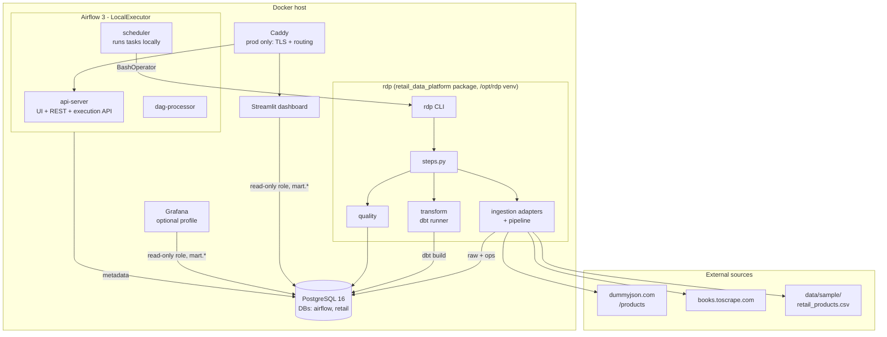
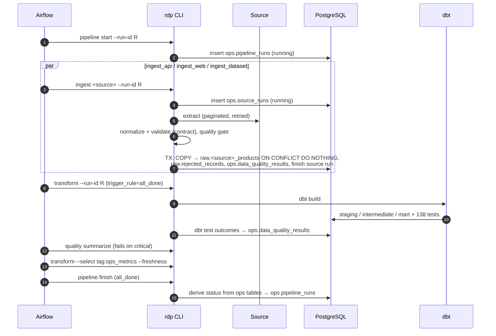

# Architecture

## Goals and constraints

- Run end to end on one machine (laptop or a single cloud VM) with `docker compose`.
- Keep business logic in a normal, testable Python package. The orchestrator only schedules it.
- Make every step idempotent and observable, so retries and re-runs are safe and diagnosable.
- Use the simplest infrastructure that satisfies the above. No streaming, no cluster.

## Component overview



| Component | Responsibility | Notes |
|---|---|---|
| `retail_data_platform` package | Acquisition, contract validation, loading, ops metadata, dbt invocation, quality evaluation | Independent of Airflow; exposed through the `rdp` CLI |
| PostgreSQL 16 | Warehouse (`retail` DB) and Airflow metadata (`airflow` DB) | Separate databases and roles; a read-only `retail_reader` role for consumers |
| dbt Core | Staging → intermediate → dimensional core → marts, tests, docs | Runs in the same venv as the package |
| Airflow 3.3 | Scheduling, retries, task dependencies, run history UI | LocalExecutor; tasks run inside the scheduler container |
| Streamlit | Analytical and operational dashboard | Reads `mart.*` only |
| Caddy | HTTPS termination, host-based routing, security headers | Production overlay only |
| Grafana | Optional ops dashboard on the same marts | `--profile observability` |

## Data flow



## Package design

```
src/retail_data_platform/
  ingestion/base.py        SourceRecord, SourceAdapter (Protocol), SourceSchemaError
  ingestion/http.py        RetryingHttpClient: timeouts, backoff+jitter, Retry-After
  ingestion/replay.py      httpx MockTransports serving data/fixtures (replay mode)
  ingestion/api/           DummyJsonAdapter (+ envelope/product schemas)
  ingestion/web/           parser.py (pure HTML parsing) + BooksToScrapeAdapter (robots, rate limit)
  ingestion/dataset/       CsvDatasetAdapter (+ file schema)
  ingestion/pipeline.py    source-agnostic validate → gate → load → metadata
  ingestion/registry.py    builds configured adapters
  models/observation.py    ProductObservation contract + record_hash
  database/                connection, migrations (SQL files + checksums + advisory lock), repositories
  quality/checks.py        QualityResult, severities, ingestion gates
  transform/               dbt subprocess runner, run_results/sources.json → QualityResult
  steps.py                 the unit of work orchestrators call
  cli/main.py              Typer CLI (`rdp`)
```

**Why a Protocol and not a base class.** The adapters share an interface (`extract`,
`normalize`), not an implementation. The shared behaviour (validation, rejects, gate, load,
metadata) lives once, in `ingestion/pipeline.py`, and applies the same rules to every source. A
new source is one class plus a registry entry. See [development.md](development.md#adding-a-new-source).

**Where the conceptual `extract / normalize / validate / load` steps live:**

| Step | Location |
|---|---|
| extract | `adapter.extract()` (source-specific) |
| normalize | `adapter.normalize()` (source-specific mapping onto the contract) |
| validate | Pydantic contract plus `pipeline.validate_records()` (shared) |
| load | `WarehouseRepository.insert_observations()` (shared, idempotent) |

## Runtime topology

| Service | Image | Port (local) | Healthcheck |
|---|---|---|---|
| postgres | `postgres:16-alpine` | 127.0.0.1:5432 | `pg_isready` on the warehouse DB |
| migrate (one-shot) | `rdp-app` (cli target) | – | must exit 0 before Airflow/dashboard start |
| airflow-init (one-shot) | `rdp-airflow` | – | `airflow db migrate` + admin user |
| airflow-apiserver | `rdp-airflow` | 127.0.0.1:8080 | `/api/v2/monitor/health` |
| airflow-scheduler | `rdp-airflow` | – | scheduler health server `:8974/health` |
| airflow-dag-processor | `rdp-airflow` | – | `airflow jobs check` |
| dashboard | `rdp-dashboard` | 127.0.0.1:8501 | `/_stcore/health` |
| tools (profile) | `rdp-app` | – | ad-hoc `rdp` commands |
| grafana (profile) | `grafana/grafana-oss` | 127.0.0.1:3000 | `/api/health` |
| caddy (prod) | `caddy:2.10-alpine` | 80, 443 | admin endpoint |

**Start-up ordering** avoids initialization races. PostgreSQL is "healthy" only once the
warehouse database created by the init script accepts connections. The `migrate` service waits
for that state, then applies migrations under a PostgreSQL advisory lock. Airflow services and
the dashboard depend on `migrate` completing successfully.

**Why no triggerer.** No task is deferrable, so the Airflow triggerer would only consume memory.

## Security model

- Secrets come only from the environment (`.env`, git-ignored, generated by `make setup`). Images
  contain no secrets. The optional `ca_bundle` build secret is mounted only for the install step.
- PostgreSQL ports bind to `127.0.0.1` locally and are not published at all in production.
- Least privilege: the warehouse, Airflow and reader roles are separate. The dashboard and
  Grafana connect as `retail_reader`, which has `SELECT` on `mart` only (verified: `permission
  denied for schema raw`).
- Containers run as non-root (`rdp` uid 10001; `airflow` uid 50000).
- SQL values are always bound parameters. Identifiers come from a closed enum and are composed
  with `psycopg.sql`.
- Airflow passes the run id to tasks through environment variables, never by templating it into
  the shell string. A user-supplied run id therefore cannot inject commands.
- The HTTP client has explicit connect and read timeouts. PostgreSQL connections set a
  `statement_timeout`.
- In production, Caddy adds HSTS, `nosniff`, frame and referrer policies, and redirects
  HTTP→HTTPS. Airflow enforces authentication (FAB auth manager), and its API returns 401 without
  a token.

## Scaling notes

The current workload (hundreds of rows per run) uses a fraction of one VM. Bottlenecks would
appear in this order: the scrape duration (bounded by politeness delays), dbt full rebuilds of
the table marts, and PostgreSQL scans of `raw` for the staging views. The first remedies are
already partly in place: the fact table is incremental, and the raw tables are indexed on
`loaded_at` and `(source_product_id, observed_at)`. The README section
[What would change at scale](../README.md#what-would-change-at-scale) covers larger changes.
