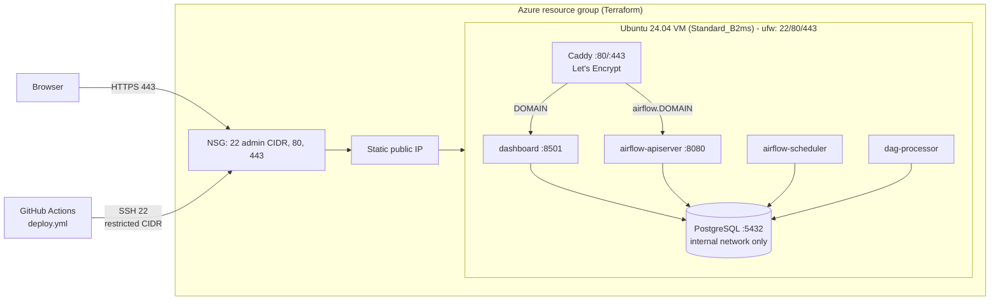

# Cloud deployment

The platform deploys to **one Ubuntu VM** running Docker Compose with the production overlay.
Any provider works: Azure, DigitalOcean, Hetzner, or AWS Lightsail. Terraform for Azure is
included as the concrete IaC example.



## Sizing and cost

Memory measured with `docker stats` on the running stack:

| Service | Idle RAM | Notes |
|---|---|---|
| airflow-scheduler | ~500 MB | spikes during runs (task processes + dbt ~300-500 MB) |
| airflow-apiserver | ~300 MB | 2 workers in prod |
| airflow-dag-processor | ~290 MB | |
| dashboard (Streamlit) | ~50 MB | grows with concurrent users |
| postgres | ~50 MB | + shared buffers under load |
| caddy | ~20 MB | |
| grafana (optional) | ~85 MB | disable to save memory |

Totals: about **1.3 GB idle** and about 2.5 GB during a pipeline run. Building images on the VM
needs about 2 GB more for a few minutes. Disk: about 6 GB of images, plus data and backups.

- **Minimum:** 2 vCPU / 4 GB RAM + 2 GB swap (Azure `Standard_B2s`, or a DigitalOcean/Hetzner
  equivalent), with Grafana disabled.
- **Recommended:** 2 vCPU / 8 GB (`Standard_B2ms`, the Terraform default), 64 GB SSD.

Exact prices vary by region and change over time; check your provider's pricing page. The costs
are the VM (the dominant cost; burstable B-series suits this mostly-idle workload), the managed
OS disk, and the static public IP. No managed database, load balancer or Kubernetes cluster is
provisioned. To save money, deallocate the VM when it is not needed
(`az vm deallocate -g rg-retail-data-platform -n vm-retail-data-platform`), or run
`terraform destroy`.

## Option A: Azure with Terraform

> **Warning:** `terraform apply` creates billable Azure resources (VM, disk, public IP).
> Run `terraform destroy` when finished.

```bash
cd infra/terraform/azure
cp terraform.tfvars.example terraform.tfvars   # set subscription_id, ssh_public_key, ssh_allowed_cidrs
az login
terraform init
terraform plan -out tfplan
terraform apply tfplan
terraform output          # public_ip, ssh_command, app_dir
```

This creates the resource group, VNet/subnet, an NSG (SSH only from `ssh_allowed_cidrs`; 80/443
from the internet; everything else, including 5432, denied), a static Standard public IP, a NIC,
and an Ubuntu 24.04 VM with SSH-key-only login. cloud-init installs Docker and Compose, enables
ufw and a 2 GB swap file, and clones the repository to `/opt/retail-data-platform`.

State stays local and is git-ignored, because it can contain sensitive values. For shared use,
add an `azurerm` backend (a Storage Account with a blob container) in `versions.tf`.

## Option B: any Ubuntu VM

```bash
ssh <user>@<vm>
sudo DEPLOY_USER=deploy REPO_URL=https://github.com/<you>/retail-data-platform.git \
     bash -c "$(curl -fsSL https://raw.githubusercontent.com/<you>/retail-data-platform/main/deploy/scripts/bootstrap.sh)"
# or: git clone … && sudo bash deploy/scripts/bootstrap.sh
```

`bootstrap.sh` is idempotent. It installs Docker from Docker's apt repository, configures log
rotation, ufw (22/80/443), the swap file and the deploy user, and clones the repository.

On other providers, also restrict SSH in the provider's firewall to your own IP.

## DNS and first deployment

1. Create DNS **A records** for `DOMAIN` and `airflow.DOMAIN` pointing at the VM's public IP.
   Caddy requests the certificates on first start, so DNS must resolve first.
2. On the VM, as the deploy user:

   ```bash
   cd /opt/retail-data-platform
   scripts/generate-env.sh             # random secrets
   nano .env                           # set DOMAIN, ACME_EMAIL; keep RDP_SOURCE_MODE=live
   deploy/scripts/deploy.sh            # build, migrate, start, health check
   ```
3. Open `https://DOMAIN` (dashboard) and `https://airflow.DOMAIN` (log in with
   `AIRFLOW_ADMIN_USERNAME` / `AIRFLOW_ADMIN_PASSWORD`). Trigger `retail_pipeline` once, or wait
   for the daily schedule.
4. Add the backup cron entry (see [operations.md](operations.md#backup-and-restore)).

**Without subdomains:** if you cannot create `airflow.DOMAIN`, serve Airflow under a path. Set
`AIRFLOW__API__BASE_URL=https://DOMAIN/airflow` in the prod overlay and replace the second
Caddy site with a `handle /airflow*` block that proxies to `airflow-apiserver:8080` inside the
`DOMAIN` site. Alternatively, keep Airflow private and reach it through an SSH tunnel
(`ssh -L 8080:localhost:8080` after publishing `127.0.0.1:8080` on the VM).

## Continuous deployment (GitHub Actions)

`.github/workflows/deploy.yml` is **manual** (`workflow_dispatch`, input `ref`). It connects
over SSH, runs `deploy/scripts/deploy.sh <ref>` on the VM, and then runs `healthcheck.sh`. The
job uses the `production` GitHub environment, so you can add required reviewers.

Required repository (or `production` environment) secrets:

| Secret | Value |
|---|---|
| `DEPLOY_HOST` | VM public IP or DNS name |
| `DEPLOY_USER` | `deploy` (the Terraform `admin_username`) |
| `DEPLOY_SSH_KEY` | private key (ed25519) whose public key is on the VM; create a dedicated deploy key |
| `DEPLOY_PATH` | `/opt/retail-data-platform` |
| `DEPLOY_KNOWN_HOSTS` | *(recommended)* output of `ssh-keyscan -H <host>`, which pins the host key |

Application secrets (database passwords, Airflow keys) stay **on the VM** in `.env` and never
pass through GitHub.

What `deploy.sh` does: validates `.env` (no `CHANGE_ME`, `DOMAIN` set) → `git fetch` /
checkout of the ref (or fast-forward pull) → `docker compose config` → `docker compose build
--pull` → `docker compose up -d --wait`. The one-shot `migrate` service applies migrations
before anything else starts, then the health checks run and images older than 7 days are
pruned. Re-running it is safe.

### Failure alerts

Set the `RDP_SMTP_*` and `RDP_ALERT_EMAIL_TO` variables in the VM's `.env` (Gmail example in
[operations.md](operations.md#failure-alerts)), redeploy, and run `make alert-test` on the VM.
The production overlay already points the email links at `https://airflow.DOMAIN` and
`https://DOMAIN`. Port 587 outbound must be allowed (it is by default on Azure; some providers
block SMTP on new accounts).

## Production security assumptions

- Only 22 (restricted to admin CIDRs), 80 and 443 are reachable. This is enforced twice: by the
  cloud firewall/NSG and by ufw on the host. Nothing except Caddy publishes a port, and
  PostgreSQL is reachable only on the internal Docker network.
- TLS everywhere via Let's Encrypt. HTTP redirects to HTTPS. HSTS and security headers are set.
- Airflow requires login (FAB auth manager), and its REST API returns 401 without a token. The
  dashboard is **public read-only** by design (portfolio). To restrict it, add Caddy
  `basic_auth` to the `DOMAIN` site.
- Secrets live only in `.env` (mode 600) on the VM. Rotation is covered in
  [operations.md](operations.md#secret-rotation).
- SSH accepts keys only. Unattended security upgrades are installed by bootstrap and cloud-init.
- Containers run as non-root, with memory limits and bounded logs.

## What can be disabled

| Component | How | Effect |
|---|---|---|
| Grafana | don't enable the `observability` profile (default) | −85 MB |
| Airflow (demo-only deployments) | run `rdp pipeline run` via cron in the `tools` container | −1.1 GB; you lose the UI and retries |
| A source | `RDP_ENABLED_SOURCES=api,dataset` | fewer requests; the run no longer expects that source |
| The VM itself | `az vm deallocate` | compute billing stops; disk and IP still billed |
