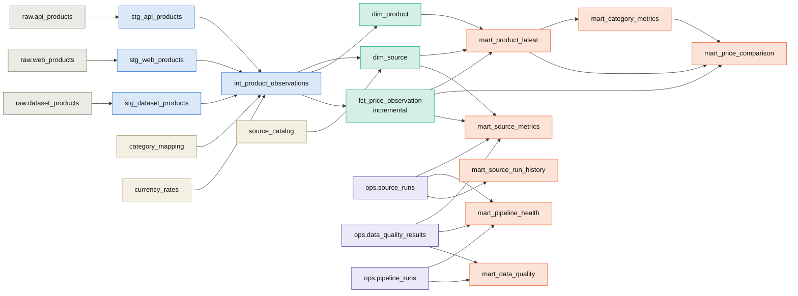

# Data model and lineage

## Layers

| Schema | Layer | Written by | Materialization | Purpose |
|---|---|---|---|---|
| `raw` | Bronze | Python ingestion | tables, append-only | Source fidelity + contract columns + ingestion metadata |
| `ops` | Operational | Python ingestion / quality | tables | Pipeline runs, source runs, quality results, migrations |
| `reference` | Reference | dbt seeds | tables | Source catalogue, category mapping, currency rates |
| `staging` | Silver | dbt | views | One model per source, canonical column set |
| `intermediate` | Silver | dbt | view | All sources conformed (keys, categories, USD) |
| `mart` | Gold | dbt | tables / incremental / views | Star schema + analytical and operational marts |

Schema objects are created deterministically: `raw` and `ops` by versioned SQL migrations
(`src/retail_data_platform/database/migrations/`), everything else by dbt. No manual DDL is
needed.

## Lineage

The interactive lineage graph with column docs is generated by `make dbt-docs`
(`dbt docs generate`; CI also builds it).

## Raw layer (bronze)

`raw.api_products`, `raw.web_products` and `raw.dataset_products` share one structure:

| Column | Meaning |
|---|---|
| `id` | Surrogate identity |
| `record_hash` | **Unique.** SHA-256 over source, source product id, observation *date*, and the business attributes |
| `source_run_id` → `ops.source_runs` | Which ingestion run produced the row |
| `pipeline_run_id` | Which pipeline (Airflow) run it belongs to |
| `source_product_id`, `product_name`, `brand`, `category`, `price`, `currency`, `availability`, `rating`, `product_url` | Contract-validated typed columns |
| `observed_at` | When the source state was observed (CSV: from the file; API/web: extraction time) |
| `ingested_at` | When the record was normalized by the pipeline |
| `loaded_at` | When the row was written (default `now()`; drives dbt freshness and the incremental fact) |
| `source_url` | Page/endpoint the record came from |
| `raw_payload` | The record exactly as delivered (`jsonb`) |

These answer the operational questions directly. *Where did this row come from?*
`source_url`, `raw_payload`. *When was it extracted, and when loaded?* `observed_at` /
`ingested_at` and `loaded_at`. *Which run produced it?* `source_run_id` and `pipeline_run_id`.
*Was the same observation already ingested?* The unique `record_hash`.

`raw.rejected_records` stores every contract violation with `errors` (field, message, type), the
original payload and a source reference (e.g. `retail_products.csv:61:HE-9001`).

### Idempotency

Loading does `COPY` into a temp table, then `INSERT … SELECT … ON CONFLICT (record_hash) DO NOTHING`
inside one transaction. Consequences:

- Re-running a source on the same day appends nothing. This is verified by tests and by the
  pipeline: the second run reports `loaded=0 duplicates=45`.
- A new day, or a changed price or availability, produces a new observation (history).
- Existing rows are never updated or deleted ([ADR 0006](adr/0006-append-only-raw-layer.md)).
- Rejected records are logged on every run. They describe the run, not the product.

## Operational schema

| Table | Grain | Key columns |
|---|---|---|
| `ops.pipeline_runs` | one pipeline run | `run_id` (Airflow run id), `status`, `started_at`, `finished_at`, `duration_seconds` (generated), row totals, `error_summary`, `alerted_at` (failure email sent) |
| `ops.source_runs` | one source ingestion attempt | `source_run_id`, `pipeline_run_id`, `source`, `source_mode`, `status`, rows extracted/valid/loaded/duplicate/rejected, `http_requests`, `error_type`, `error_summary`, `duration_seconds` |
| `ops.data_quality_results` | one check outcome | `check_name`, `layer` (ingestion/dbt/freshness), `severity`, `status`, `observed_value`, `threshold`, `details` |
| `ops.schema_migrations` | one applied migration | `version`, `checksum`, `applied_at` |

## dbt models

### Staging (`staging` schema, views)

`stg_api_products`, `stg_web_products` and `stg_dataset_products` rename and standardize to an
identical column set (`observation_id`, `source`, `source_product_id`, `product_name`, `brand`,
`source_category`, `retailer`, `price`, `currency`, `availability`, `rating`, `stock_quantity`,
`discount_pct`, `sku`, `product_url`, `observed_at`, `loaded_at`, lineage ids). Source-specific
attributes are extracted from `raw_payload`: stock, discount and SKU for the API, and the
retailer for the dataset.

### Intermediate (`intermediate.int_product_observations`, view)

- Union of the staging models.
- `product_key = md5(source || '|' || source_product_id)`. Products are **not** matched across
  sources, because the catalogues are disjoint and an invented cross-source identity would be
  wrong.
- `category` is mapped through the `category_mapping` seed (e.g. `smartphones`, `travel` →
  `Smartphones`, `Books`), with an `initcap` fallback plus a warning test for unmapped values.
- `price_usd` uses the `currency_rates` seed. These are static reference rates, intentionally
  not live FX.

### Core (`mart` schema)

| Model | Grain | Materialization | Notes |
|---|---|---|---|
| `dim_source` | source | table | Seed catalogue + observed coverage |
| `dim_product` | product (per source) | table | SCD1: latest name/brand/category/url, first/last seen, observation count |
| `fct_price_observation` | observed product state | **incremental** (`delete+insert` on `observation_id`, watermark on `loaded_at`) | price, currency, USD price, availability, rating, stock, discount, lineage ids |

### Analytical marts

| Model | Grain | Question it answers |
|---|---|---|
| `mart_product_latest` | product | What is each product's current price and availability? |
| `mart_category_metrics` | category | How do price levels, availability and ratings compare across categories and sources? |
| `mart_price_comparison` | product | How did the price move vs the previous observation? Where does it sit vs its category median (price index)? |

### Operational marts (tag `ops_metrics`)

| Model | Materialization | Purpose |
|---|---|---|
| `mart_source_metrics` | table (rebuilt by `refresh_metrics`) | Per source: last run, last success, hours since success, `is_stale`, 7-day failures/rejects/failed checks |
| `mart_pipeline_health` | view | Per run: status, duration, rows, critical/warning counts, `health` (healthy/warning/critical/running/abandoned) |
| `mart_source_run_history` | view | All source runs |
| `mart_data_quality` | view | All check outcomes with run context |

The ops marts read `ops.*` through dbt sources, so consumers (the dashboard and Grafana) never
query anything outside `mart`.
