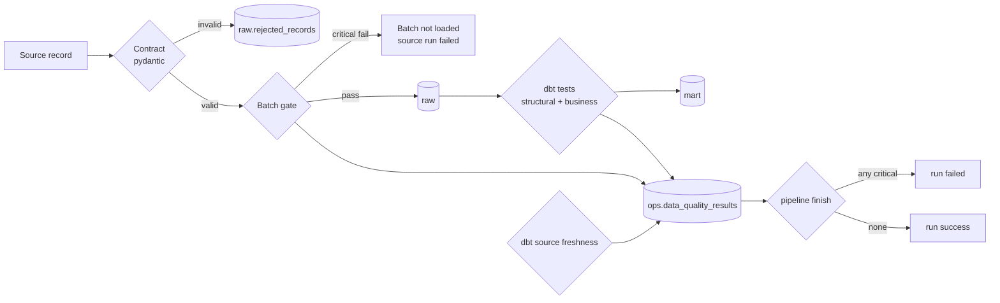

# Data quality strategy

Quality is enforced at three layers. Each one catches a different class of problem, and all
results land in **one table** (`ops.data_quality_results`). The dashboard, Grafana and the
pipeline's final verdict read from that table.



## Severities

| Severity | Effect | Examples |
|---|---|---|
| **critical** | Fails the pipeline run. At the ingestion gate it also blocks the batch from loading | source returned 0 rows; reject ratio above threshold; any dbt test with `severity: error`; a dbt model error; freshness `error_after` exceeded |
| **warning** | Recorded and shown on the dashboard. The run still succeeds | some rejected records; unmapped categories; price change above ±50%; freshness `warn_after` exceeded; models skipped |
| **info** | A metric tracked over time | rows loaded and duplicates skipped per source run |

## Layer 1: ingestion boundary (Python)

**Record contract** (`models/observation.py`, enforced by Pydantic for every source):

- required: `source_product_id`, `product_name` (non-empty), `price` (≥ 0, at most 2 decimals),
  `currency` (ISO-4217 pattern), `observed_at` (timezone-aware)
- `observed_at` may not be more than 1 h ahead of `ingested_at` (catches clock or parsing errors)
- `rating` between 0 and 5, `product_url` an absolute http(s) URL, unknown fields forbidden
- blank strings become `NULL` for optional attributes (`brand`, `category`). Nullability is
  explicit: books have no brand, and groceries in DummyJSON have none either.

**Source-structure checks** abort the whole source run (`SourceSchemaError`). An unexpected API
envelope, a changed page structure, or missing CSV columns means no record from that source can
be trusted.

**Batch gate** (`quality/checks.py`) runs before anything is committed:

| Check | Severity | Default |
|---|---|---|
| `ingestion.min_rows_extracted` | critical | ≥ `RDP_MIN_ROWS_PER_SOURCE` (1) |
| `ingestion.reject_ratio` | critical | ≤ `RDP_MAX_REJECT_RATIO` (0.2) |
| `ingestion.no_rejected_records` | warning | 0 |
| `ingestion.rows_loaded` | info | – |

If a critical gate fails, the valid rows are **not** loaded. A batch where, say, 50% of records
fail validation usually means the upstream contract changed, and loading the "valid" half would
silently skew the marts. The rejects and the gate results are still persisted for diagnosis.

Rejected records are never silently dropped. Each one is stored with its field-level errors:

```sql
select source_record_ref, errors from raw.rejected_records order by rejected_at desc limit 3;
-- retail_products.csv:61:HE-9001 | [{"loc": "price", "msg": "Input should be greater than or equal to 0", ...}]
-- retail_products.csv:62:NM-9002 | [{"loc": "product_name", "msg": "String should have at least 1 character", ...}]
-- retail_products.csv:63:GG-9003 | [{"loc": "price", "msg": "Value error, price 'N/A' is not a number", ...}]
```

## Layer 2: dbt tests (138 tests)

| Kind | Where | Examples |
|---|---|---|
| Structural | every layer | `unique` / `not_null` on keys, `accepted_values` for availability/status/health |
| Referential | staging → marts | `relationships`: currency → `currency_rates`, fact → `dim_product` / `dim_source`, mart → `dim_product` |
| Business rules (custom generic) | `tests/generic/` | `non_negative(price)`, `not_in_future(observed_at, tolerance)`, `value_between(rating, 0, 5)`, `unique_combination_of_columns(source, source_product_id)` |
| Gold consistency (singular) | `tests/*.sql` | latest mart matches the latest fact row; no product lost between fact and mart; no two prices at the same instant |
| Warnings | | unmapped categories, `price_change_pct` outside ±50% (`severity: warn`) |

`rdp transform` runs `dbt build`, which runs tests in DAG order, so a failing staging test stops
downstream models from building on bad data. It then parses `run_results.json` and
`manifest.json` into quality results. The configured severity of each test (`error` → critical,
`warn` → warning) is preserved.

## Layer 3: freshness and operational checks

- `dbt source freshness` on `raw.api_products` and `raw.web_products` (`loaded_at`):
  warn after 26 h, error after 72 h. The CSV dataset only changes when the file changes, so its
  freshness comes from successful source runs (`mart_source_metrics.is_stale`) instead.
- `pipeline finish` fails the run when an expected source has no successful run, even if the
  task crashed before it could record anything.

## Where to look

- Dashboard → **Pipeline Health → Data-quality findings** (last 7 days, critical first)
- `select * from mart.mart_data_quality where status in ('fail','error') order by checked_at desc;`
- `rdp quality summarize --run-id <run>` prints the failing checks and exits 1 on critical

## Why no Great Expectations

The Pydantic contract covers record-level validation at the boundary. dbt tests cover set-level
and relational rules in the warehouse. Both are already versioned and tested, and they feed one
results table. Great Expectations would add a third configuration surface, plus another
dependency tree inside the Airflow image, without catching a class of issue the current layers
miss. It becomes worth adding if you need rich profiling, data docs for non-engineers, or
expectations shared across many pipelines.

## Adding a check

- Record-level rule: add a validator to `ProductObservation` (or to a source payload model), plus
  a test in `tests/unit/test_contract.py`.
- Batch rule: extend `ingestion_checks()` and give it a severity.
- Warehouse rule: add a generic test in `dbt/tests/generic/` or a singular test in `dbt/tests/`,
  and set `config: {severity: warn}` if it should not fail runs.
