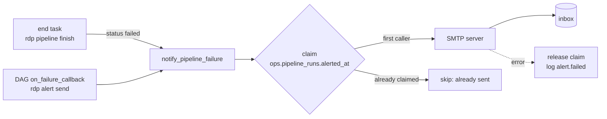

# Observability

Lightweight on purpose: no metrics stack to operate. Everything needed to answer *"did it run,
how long did it take, how much data moved, what failed, and is the data fresh?"* is persisted in
PostgreSQL and surfaced through the marts.

| Signal | Where |
|---|---|
| Structured logs | stdout/stderr of every container (JSON); Airflow task logs |
| Pipeline run metadata | `ops.pipeline_runs` → `mart.mart_pipeline_health` |
| Source run metadata (row counts, duration, HTTP requests, errors) | `ops.source_runs` → `mart.mart_source_run_history`, `mart.mart_source_metrics` |
| Quality status | `ops.data_quality_results` → `mart.mart_data_quality`, `mart_pipeline_health.health` |
| Freshness | `dbt source freshness` results + `mart_source_metrics.hours_since_last_success` / `is_stale` |
| Service health | Docker healthchecks on every long-running service; `rdp smoke`; `deploy/scripts/healthcheck.sh` |
| Orchestration | Airflow UI (grid, durations, retries, task logs) |
| Dashboards | Streamlit **Pipeline Health** page; optional Grafana "Retail Data Platform - Operations" |
| Alerts | One email per failed run via SMTP (see [Alerting](#alerting-email)) |

## Structured logs

All application logging goes through `structlog` (`observability/logging.py`), one JSON object
per line, never `print()`. Context is bound once and attached to every event: `run_id`,
`source`, `source_run_id`, `operation`. Operations log `started`, then `finished` or `failed`,
with a duration:

```json
{"source_mode": "replay", "run_id": "manual__20261002T031813Z", "source": "dataset",
 "source_run_id": "32d8...", "operation": "ingest", "event": "operation.finished",
 "duration_seconds": 0.025, "status": "success", "rows_extracted": 62, "rows_loaded": 59,
 "rows_duplicate": 0, "rows_rejected": 3, "level": "info", "timestamp": "2026-10-02T03:18:30Z"}
```

Failures add `exception_type` and a truncated `error`. HTTP retries log `http.retry` with the
attempt number, status code or exception, and the delay. Set `RDP_LOG_FORMAT=console` for
human-readable local output. Secrets never appear in logs: the DB password is a `SecretStr`
and is not part of the connection string.

```bash
docker compose logs airflow-scheduler | grep operation.failed     # task-level failures
docker compose exec airflow-scheduler ls /opt/airflow/logs        # Airflow task log files
```

## Useful queries

```sql
-- last 10 runs with outcome
select run_id, status, health, duration_seconds, rows_loaded, critical_failures, warnings
from mart.mart_pipeline_health order by started_at desc limit 10;

-- slowest / failing source runs this week
select source, status, duration_seconds, rows_extracted, rows_rejected, error_type, error_summary
from mart.mart_source_run_history
where started_at > now() - interval '7 days'
order by status desc, duration_seconds desc;

-- freshness
select source, last_success_at, hours_since_last_success, is_stale from mart.mart_source_metrics;
```

## Health states

`mart_pipeline_health.health`:

| Value | Meaning |
|---|---|
| `healthy` | succeeded, no failing checks |
| `warning` | succeeded with warning-level findings (e.g. rejected CSV rows) |
| `critical` | failed, or a critical check failed |
| `running` | in progress |
| `abandoned` | still `running` more than 6 h after start: the worker died before the `end` task |

## Grafana (optional)

```bash
make grafana     # docker compose --profile observability up -d grafana
```

Grafana is provisioned from `observability/grafana/`. It gets a PostgreSQL datasource using the
read-only role, and an "Operations" dashboard: last run health, stale sources, products in Gold,
critical checks (7 d), run durations, rows loaded and rejected per source run, freshness table,
and failing checks. It reads the same marts as the Streamlit dashboard, so it needs no extra
instrumentation, and it can be left disabled to save about 100 MB of RAM.

Prometheus is intentionally absent. The platform emits batch-run facts, not continuous
time-series, and those already live in PostgreSQL with full context. Prometheus would be
justified for host and container metrics at a larger scale (node-exporter or cAdvisor), or for
alerting rules.

## Alerting (email)

When a pipeline run fails, the platform sends **one** plain-text email: the run id, timings and
row counts, what failed (`error_summary`), the failed sources with their error types, the failing
quality checks (critical first), links to the Airflow run and the dashboard, and the command to
investigate (`rdp quality summarize --run-id …`).



- **Two triggers, one email.** The `end` task sends the alert for any failed run. The DAG-level
  `on_failure_callback` is a safety net for runs that fail without reaching `end` (for example a
  `dagrun_timeout`). Both go through an atomic claim on `ops.pipeline_runs.alerted_at`, so a run
  is emailed at most once. Verified end to end: on a forced failure the `end` task sent the email
  and the callback logged `alert.skipped reason="already sent"`.
- **Never masks the result.** An SMTP error is logged as `alert.failed`. The run keeps its
  status, and the claim is released so `rdp alert send --run-id <id>` can retry.
- **Optional.** Without `RDP_SMTP_HOST` and `RDP_ALERT_EMAIL_TO`, alerting is a logged no-op.
- `mart_pipeline_health.alerted_at` (and the dashboard's runs table) show when each alert went out.

Configuration (`.env`):

| Variable | Example | Notes |
|---|---|---|
| `RDP_SMTP_HOST` / `RDP_SMTP_PORT` | `smtp.gmail.com` / `587` | |
| `RDP_SMTP_SECURITY` | `starttls` | `starttls` (587), `ssl` (465) or `none` (local catcher only) |
| `RDP_SMTP_USER` / `RDP_SMTP_PASSWORD` | `you@gmail.com` / App Password | Gmail requires 2FA and an App Password |
| `RDP_ALERT_EMAIL_FROM` | `alerts@yourdomain` | defaults to `RDP_SMTP_USER` |
| `RDP_ALERT_EMAIL_TO` | `you@gmail.com,team@x.com` | comma-separated |
| `RDP_AIRFLOW_URL` / `RDP_DASHBOARD_URL` | `https://airflow.DOMAIN` / `https://DOMAIN` | links in the email; set automatically in production |

Commands:

```bash
make alert-test                                  # rdp alert test: send a test email
docker compose run --rm tools alert send --run-id <run_id>          # (re)send for a failed run
docker compose run --rm tools alert send --run-id <run_id> --force  # resend even if already sent
make mailpit                                     # local SMTP catcher, UI on http://localhost:8025
```
